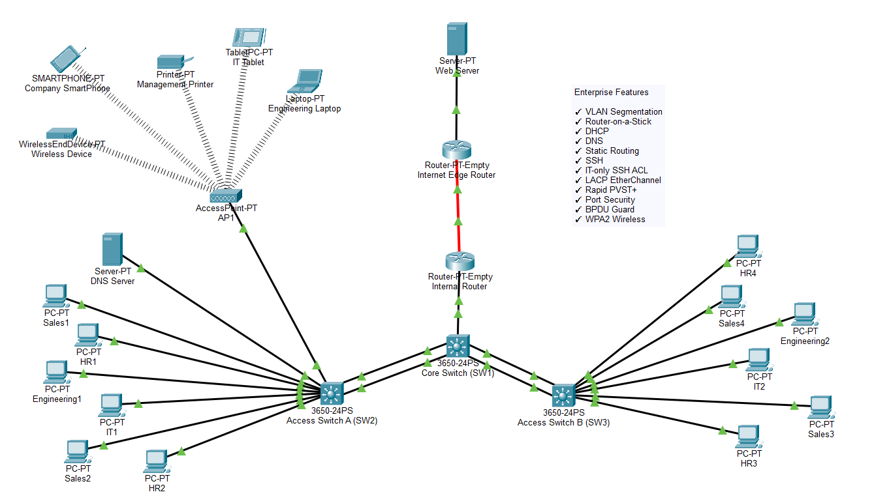
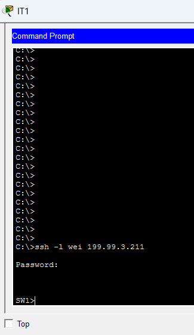
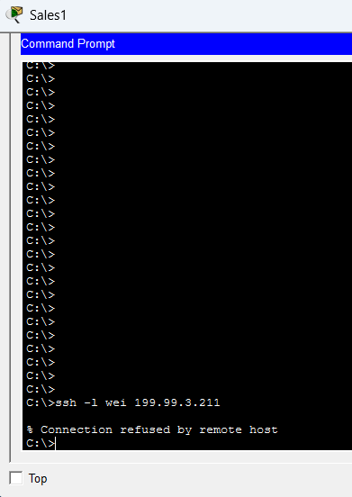
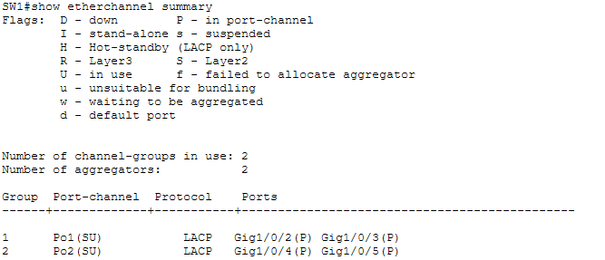
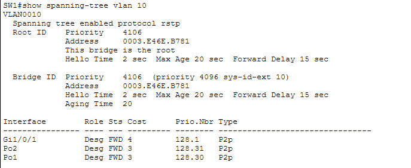
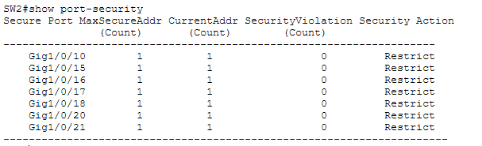
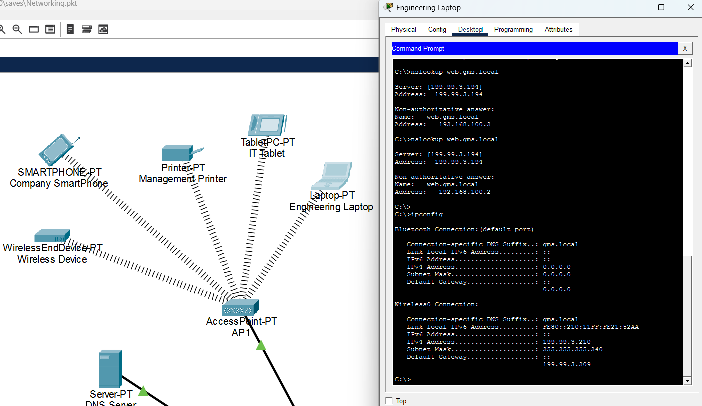
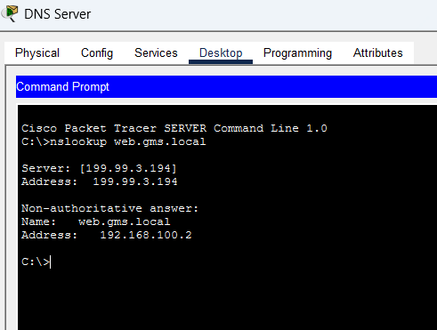
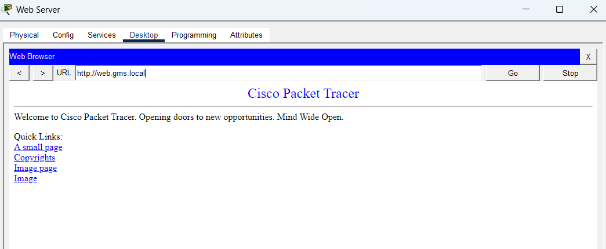

# Enterprise Network Infrastructure for Global Manufacturing Solutions (GMS)

> Designed and implemented a secure enterprise network in Cisco Packet Tracer featuring VLAN segmentation, inter-VLAN routing, centralized network services, redundancy, secure remote management, and wireless connectivity.



---

## Project Overview

This project was completed as the final assignment for an Enterprise Networking course. The objective was to design and prototype a secure, reliable, and scalable network for a manufacturing company using Cisco Packet Tracer.

The network was built to support multiple departments while providing centralized services such as DHCP, DNS, wireless connectivity, and secure remote administration. To improve reliability and security, the design also includes redundant switch connections using EtherChannel, Rapid PVST+, SSH management, access control lists, and port security.

In addition to meeting the original project requirements, I implemented several extra enterprise networking features to create a more realistic production-style network.

---

## Network Topology


---

## Network Architecture

The network follows a hierarchical enterprise design consisting of:

- Internet Edge Router connected to an external web server
- Internal router providing inter-VLAN routing
- Core switch connecting two access switches
- Two access switches serving multiple departments
- Dedicated DNS server
- Wireless access point supporting multiple wireless devices

Departmental traffic is separated using VLANs while shared network services remain accessible through controlled routing.

---

## VLAN Design

| VLAN | Department | Purpose |
|------|------------|---------|
| 10 | Sales | Employee Workstations |
| 20 | HR | Human Resources |
| 30 | Engineering | Engineering Department |
| 40 | IT | IT Administration |
| 50 | Servers | DNS and Network Services |
| 60 | Management | Network Management & Wireless |

---

## Features

- VLAN segmentation using IEEE 802.1Q
- Router-on-a-Stick inter-VLAN routing
- VLSM subnetting
- DHCP for all VLANs
- Internal DNS server
- External web server
- Static routing between internal and edge routers
- SSH remote management
- IT-only SSH management using Standard ACLs
- LACP EtherChannel
- Rapid PVST+
- Port Security with Sticky MAC addresses
- PortFast
- BPDU Guard
- WPA2-secured wireless network

---

## Screenshots

### SSH Access Control

Only devices in the IT VLAN are permitted to remotely manage network devices through SSH.

**Successful SSH Login**



**SSH Blocked from Non-IT VLAN**



---

### EtherChannel

LACP EtherChannel configured between the core and access switches.



---

### Rapid PVST+

Rapid PVST+ provides Layer 2 redundancy while preventing switching loops.



---

### Port Security

Port Security with Sticky MAC addresses configured on access ports.



---

### Wireless Connectivity

Wireless clients authenticate using WPA2-PSK and receive IP addresses through DHCP.



---

### DNS Resolution

Internal DNS server resolving hostnames.



---

### External Web Server

Clients successfully access the external web server through static routing.



---

## Technologies Used

- Cisco Packet Tracer
- VLANs (802.1Q)
- Router-on-a-Stick
- VLSM Subnetting
- DHCP
- DNS
- Static Routing
- SSH
- Standard ACLs
- LACP EtherChannel
- Rapid PVST+
- Port Security
- BPDU Guard
- WPA2 Wireless

---

## Lessons Learned

This project gave me hands-on experience designing, configuring, and troubleshooting a complete enterprise network instead of configuring individual devices separately.

Throughout the project, I learned how Layer 2 and Layer 3 technologies work together to provide secure and reliable communication across multiple departments. I also gained practical experience troubleshooting VLAN configuration, EtherChannel negotiation, spanning tree behavior, DHCP, routing, DNS, wireless connectivity, and network security.

Working through configuration issues and validating each feature helped me better understand how enterprise networks are designed, secured, and maintained.

---

## Repository Contents

```
.
├── GMS_Enterprise_Network_Final.pkt
├── README.md
├── LICENSE
└── screenshots
    ├── topology.png
    ├── ssh-success.png
    ├── ssh-denied.png
    ├── etherchannel.png
    ├── spanning-tree.png
    ├── portsecurity.png
    ├── wireless.png
    ├── dns.png
    └── webserver.png
```
